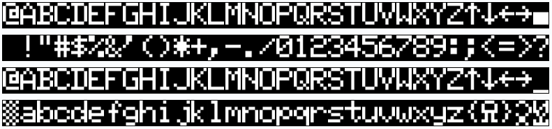
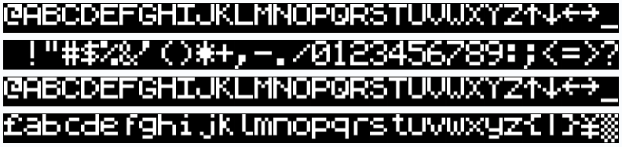

# TRS-80 Model 1 Character Generator ROMs - 16 Options

*Suitable for 2x256 ROMs*

## Specific Versions

This character ROM is combining multiple other character generator ROMs in one binary to be able to select a specific ROM on-the-fly.

There are four versions (click to download):
- [Normal](character_set_16s.bin) - Here, all ROMs are sequentially listed. This is the default option.
- [Reversed/Inverted](character_set_16s_r.bin) - All address are inverted (effectively reversing the normal list). This is useful if your adapter uses active-low addressing. Use this when using solder jumpers or jumper caps to configure 
- [Bit-Flipped](character_set_16s_f.bin) - All bits in an address are flipped from MSB to LSB. This is useful if you want to set the bit-address for selection from left-to-right (like using a DIP switch).
- [Reversed/Inverted & Bit-Flipped](character_set_16s_rf.bin) - Combines the last two options in one: all addresses are inverted and the bits are flipped. Use this when using DIP switches to configure any RetroStack character generator adapters (like the [MCM776x character generator adapter](https://github.com/RetroStack/MCM776x_CharGen_Adapter)).

|#|Bit Address (Normal)| Bit Address (Bit-Flipped)|Name|Source|Comment|Character Set|
|-|-|-|-|-|-|-|
|01|`0000`|`0000`|01 - CG0 - First|xtras|Floating a, no arrows, no pound sign, no descenders, no duplicate||
|02|`0001`|`1000`|16 - CG2 - Latest|xtras|No floating a, arrows & pound sign, descenders, duplicate||
|03|`0010`|`0100`|Kana||Japanese||
|04|`0011`|`1100`|GenDon 3 6A|[link](https://forum.vcfed.org/index.php?threads/gendon3-improved-character-generator-for-the-model-i-discussion.59498/)|No mod is needed! (modified to fit)||
|05|`0100`|`0010`|GenDon 3 9E|[link](https://forum.vcfed.org/index.php?threads/gendon3-improved-character-generator-for-the-model-i-discussion.59498/)|No mod is needed! (modified to fit)||
|06|`0101`|`1010`|GenDon 3 -61|[link](https://forum.vcfed.org/index.php?threads/gendon3-improved-character-generator-for-the-model-i-discussion.59498/)|No mod is needed! (modified to fit)||
|07|`0110`|`0110`|Set All|RetroStack|Noise check; Debugging Set||
|08|`0111`|`1110`|Blank|RetroStack|Noise check; Debugging Set||
|09|`1000`|`0001`|Cross|RetroStack|Alignment check; Debugging Set||
|10|`1001`|`1001`|Xs|RetroStack|Distortion check; Debugging Set||
|11|`1010`|`0101`|Hitachi HD44780U|Datasheet|LCD Display (modified to fit)||
|12|`1011`|`1101`|Mullard SAA5050|Datasheet|Teletext (modified to fit)||
|13|`1100`|`0011`|Signetics 2513|Datasheet|Used in Apple I (modified to fit)||
|14|`1101`|`1011`|Motorola MC4847|Datasheet|(modified to fit)||
|15|`1110`|`0111`|Cyber|[link](http://www.6502.org/users/sjgray/computer/cbmchr/cbmchr.html)|(modified to fit)||
|16|`1111`|`1111`|Sinclair Spectrum|?|(modified to fit)||

## Combinations

This character ROM is combining multiple other character generator ROMs in one binary to be able to select a specific ROM on-the-fly. There are four versions:
- [Normal](character_set_16.bin) - Here, all ROMs are sequentially listed according to the bit pattern.
- [Reversed/Inverted](character_set_16_r.bin) - All address are inverted (effectively reversing the normal list). This is useful if your adapter uses active-low addressing. Use this when using solder jumpers or jumper caps to configure 
- [Bit-Flipped](character_set_16_f.bin) - All bits in an address are flipped from MSB to LSB. This is useful if you want to set the bit-address for selection from left-to-right (like using a DIP switch).
- [Reversed/Inverted & Bit-Flipped](character_set_16_rf.bin) - Combines the last two options in one: all addresses are inverted and the bits are flipped. Use this when using DIP switches to configure any RetroStack character generator adapters (like the [MCM776x character generator adapter](https://github.com/RetroStack/MCM776x_CharGen_Adapter)).

This combined character set has all combinations across features and changes from the original. You can select each feature by toggling the bits.

|Bit|Description|Example Image|
|-|-|-|
|`1`|Floating "a"||
|`2`|Special characters like arrows & pound sign||
|`3`|Descenders||
|`4`|Duplicate capital letters||
