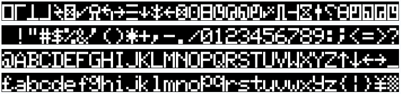
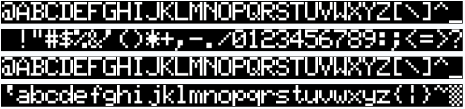

# TRS-80 Model 1 Character Generator ROMs - 4 Options - Suitable for 2x64 ROMs

This character ROM is combining multiple other character generator ROMs in one binary to be able to select a specific ROM on-the-fly. There are four versions:
- [Normal](character_set_4s.bin) - Here, all ROMs are sequentially listed. This is the default option.
- [Reversed/Inverted](character_set_4s_r.bin) - All address are inverted (effectively reversing the normal list). This is useful if your adapter uses active-low addressing. Use this when using solder jumpers or jumper caps to configure 
- [Bit-Flipped](character_set_4s_f.bin) - All bits in an address are flipped from MSB to LSB. This is useful if you want to set the bit-address for selection from left-to-right (like using a DIP switch).
- [Reversed/Inverted & Bit-Flipped](character_set_4s_rf.bin) - Combines the last two options in one: all addresses are inverted and the bits are flipped. Use this when using DIP switches to configure any RetroStack character generator adapters (like the [MCM776x character generator adapter](https://github.com/RetroStack/MCM776x_CharGen_Adapter)).

|#|Bit Address (Normal)| Bit Address (Bit-Flipped)|Name|Source|Comment|Character Set|
|-|-|-|-|-|-|-|
|1|`00`|`00`|01 - CG0 - First|xtras|Floating a, no arrows, no pound sign, no descenders, no duplicate||
|2|`01`|`10`|04|RetroStack|No floating a, arrows & pound sign, no descenders, no duplicate||
|3|`10`|`01`|14|RetroStack|No floating a, no arrows, no pound sign, descenders, duplicate||
|4|`11`|`11`|16 - CG2 - Latest|xtras|No floating a, arrows & pound sign, descenders, duplicate||

