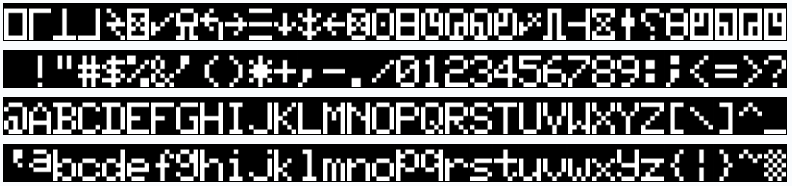
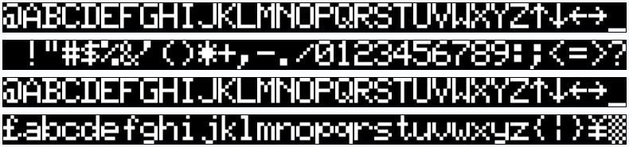
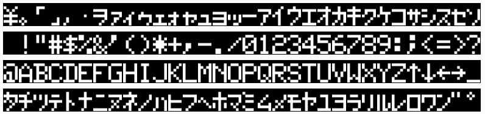
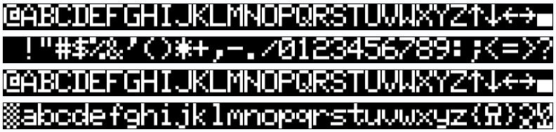
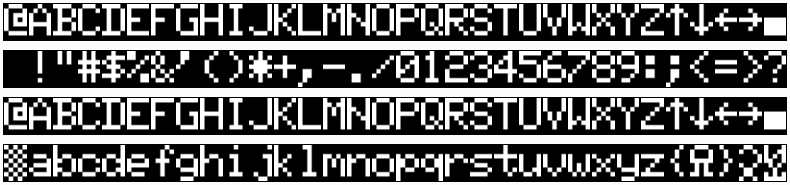
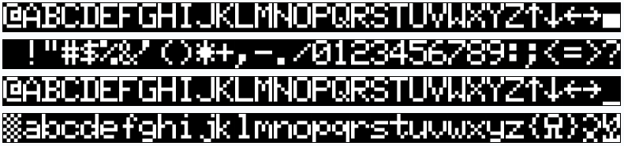
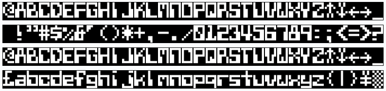
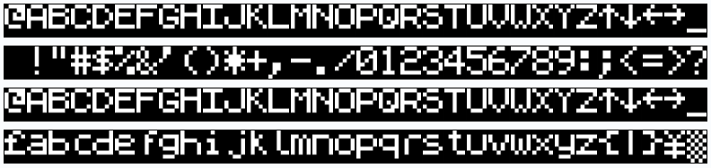

# TRS-80 Model 1 Character Generator ROMs - 8 Options - Suitable for 2x128 ROMs

This character ROM is combining multiple other character generator ROMs in one binary to be able to select a specific ROM on-the-fly. There are four versions:

This character ROM is combining multiple other character generator ROMs in one binary to be able to select a specific ROM on-the-fly. There are four versions:
- [Normal](character_set_8s.bin) - Here, all ROMs are sequentially listed. This is the default option.
- [Reversed/Inverted](character_set_8s_r.bin) - All address are inverted (effectively reversing the normal list). This is useful if your adapter uses active-low addressing. Use this when using solder jumpers or jumper caps to configure 
- [Bit-Flipped](character_set_8s_f.bin) - All bits in an address are flipped from MSB to LSB. This is useful if you want to set the bit-address for selection from left-to-right (like using a DIP switch).
- [Reversed/Inverted & Bit-Flipped](character_set_8s_rf.bin) - Combines the last two options in one: all addresses are inverted and the bits are flipped. Use this when using DIP switches to configure any RetroStack character generator adapters (like the [MCM776x character generator adapter](https://github.com/RetroStack/MCM776x_CharGen_Adapter)).

|#|Bit Address (Normal)| Bit Address (Bit-Flipped)|Name|Source|Comment|Character Set|
|-|-|-|-|-|-|-|
|1|`000`|`000`|01 - CG0 - First|xtras|Floating a, no arrows, no pound sign, no descenders, no duplicate||
|2|`001`|`100`|16 - CG2 - Latest|xtras|No floating a, arrows & pound sign, descenders, duplicate|||
|3|`010`|`010`|Kana||Japanese||
|4|`011`|`110`|GenDon 3 6A|[link](https://forum.vcfed.org/index.php?threads/gendon3-improved-character-generator-for-the-model-i-discussion.59498/)|No mod is needed! (modified to fit)||
|5|`100`|`001`|GenDon 3 9E|[link](https://forum.vcfed.org/index.php?threads/gendon3-improved-character-generator-for-the-model-i-discussion.59498/)|No mod is needed! (modified to fit)||
|6|`101`|`101`|GenDon 3 -61|[link](https://forum.vcfed.org/index.php?threads/gendon3-improved-character-generator-for-the-model-i-discussion.59498/)|No mod is needed! (modified to fit)||
|7|`110`|`011`|Cyber|[link](http://www.6502.org/users/sjgray/computer/cbmchr/cbmchr.html)|(modified to fit)||
|8|`111`|`111`|Sinclair Spectrum|?|(modified to fit)||
