# TRS-80 Model 1 Character Generator ROMs - Individual ROMs

These are individual ROMs to be used on its own.

|Name|Source|Comment|Character Set
|-|-|-|-|
|[01 - CG0 - First](character_set_01.bin)|xtras|Floating a, no arrows, no pound sign, no descenders, no duplicate||
|[02](character_set_02.bin)||No floating a, no arrows, no pound sign, no descenders, no duplicate|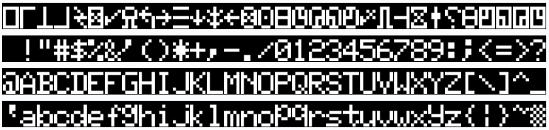|
|[03](character_set_03.bin)||Floating a, arrows & pound sign, no descenders, no duplicate||
|[04](character_set_04.bin)||No floating a, arrows & pound sign, no descenders, no duplicate|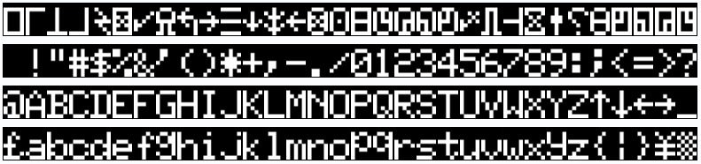|
|[05](character_set_05.bin)||Floating a, no arrows, no pound sign, descenders, no duplicate||
|[06](character_set_06.bin)||No floating a, no arrows, no pound sign, descenders, no duplicate||
|[07](character_set_07.bin)||Floating a, arrows & pound sign, descenders, no duplicate||
|[08](character_set_08.bin)||No floating a, arrows & pound sign, descenders, no duplicate|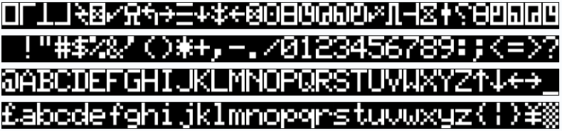|
|[09](character_set_09.bin)||Floating a, no arrows, no pound sign, no descenders, duplicate|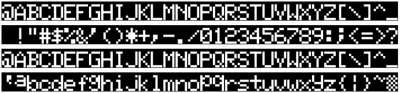|
|[10](character_set_10.bin)||No floating a, no arrows, no pound sign, no descenders, duplicate||
|[11](character_set_11.bin)||Floating a, arrows & pound sign, no descenders, duplicate||
|[12](character_set_12.bin)||No floating a, arrows & pound sign, no descenders, duplicate||
|[13](character_set_13.bin)||Floating a, no arrows, no pound sign, descenders, duplicate|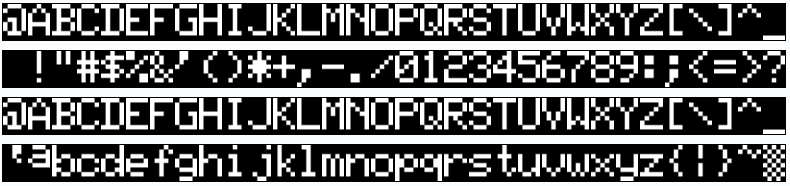|
|[14](character_set_14.bin)||No floating a, no arrows, no pound sign, descenders, duplicate||
|[15](character_set_15.bin)||Floating a, arrows & pound sign, descenders, duplicate|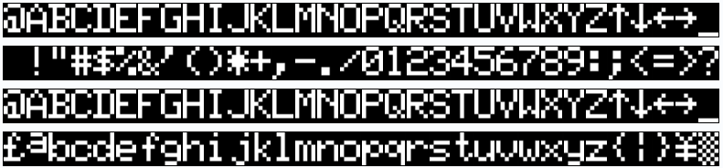|
|[16 - CG2 - Latest](character_set_16.bin)|xtras|No floating a, arrows & pound sign, descenders, duplicate|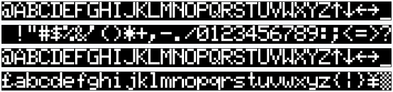|
|[Kana](character_set_17.bin)||Japanese||
|[GenDon 3 6A](character_set_18.bin)|[link](https://forum.vcfed.org/index.php?threads/gendon3-improved-character-generator-for-the-model-i-discussion.59498/)|No mod is needed! (modified to fit)||
|[GenDon 3 9E](character_set_19.bin)|[link](https://forum.vcfed.org/index.php?threads/gendon3-improved-character-generator-for-the-model-i-discussion.59498/)|No mod is needed! (modified to fit)|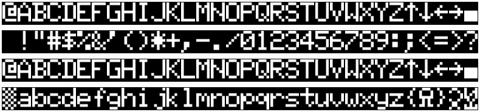|
|[GenDon 3 -61](character_set_20.bin)|[link](https://forum.vcfed.org/index.php?threads/gendon3-improved-character-generator-for-the-model-i-discussion.59498/)|No mod is needed! (modified to fit)||
|[Set All](character_set_21.bin)|RetroStack|Noise check; Debugging Set||
|[Blank](character_set_22.bin)|RetroStack|Noise check; Debugging Set||
|[Cross](character_set_23.bin)|RetroStack|Alignment check; Debugging Set||
|[Xs](character_set_24.bin)|RetroStack|Distortion check; Debugging Set|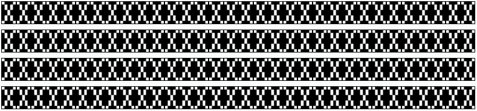|
|[Hitachi HD44780U](character_set_25.bin)|Datasheet|LCD Display (modified to fit)||
|[Mullard SAA5050](character_set_26.bin)|Datasheet|Teletext (modified to fit)|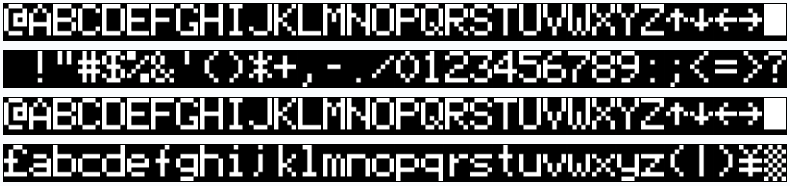|
|[Signetics 2513](character_set_27.bin)|Datasheet|Used in Apple I (modified to fit)||
|[Motorola MC4847](character_set_28.bin)|Datasheet|(modified to fit)|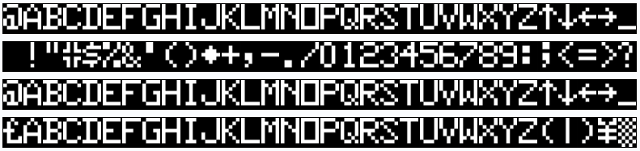|
|[Cyber](character_set_29.bin)|[link](http://www.6502.org/users/sjgray/computer/cbmchr/cbmchr.html)|(modified to fit)||
|[Sinclair Spectrum](character_set_30.bin)|?|(modified to fit)||
