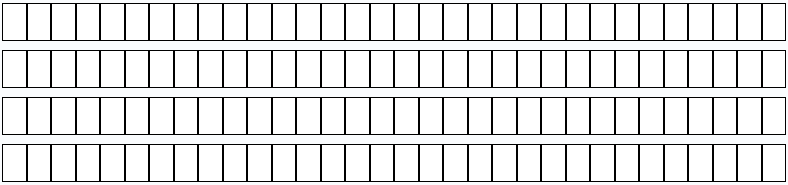
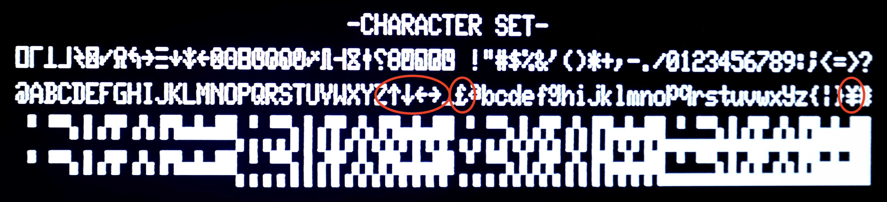
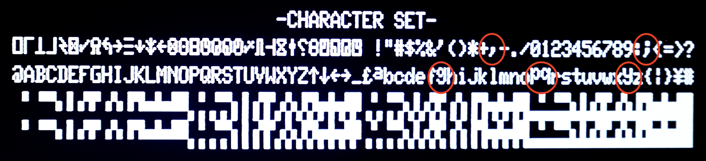

# TRS-80 Model 1 Character Generator ROMs

Following is a list of various character generator ROMs that can be used with the TRS-80 Model 1.

## Individual ROMs

These are individual ROMs to be used on its own.

|Name|Source|Comment|Character Set
|-|-|-|-|
|[01 - CG0 - First](Individual/character_set_01.bin)|xtras|Floating a, no arrows, no pound sign, no descenders, no duplicate||
|[02](Individual/character_set_01.bin)||No floating a, no arrows, no pound sign, no descenders, no duplicate||
|[03](Individual/character_set_01.bin)||Floating a, arrows & pound sign, no descenders, no duplicate||
|[04](Individual/character_set_01.bin)||No floating a, arrows & pound sign, no descenders, no duplicate||
|[05](Individual/character_set_01.bin)||Floating a, no arrows, no pound sign, descenders, no duplicate||
|[06](Individual/character_set_01.bin)||No floating a, no arrows, no pound sign, descenders, no duplicate||
|[07](Individual/character_set_01.bin)||Floating a, arrows & pound sign, descenders, no duplicate||
|[08](Individual/character_set_01.bin)||No floating a, arrows & pound sign, descenders, no duplicate||
|[09](Individual/character_set_01.bin)||Floating a, no arrows, no pound sign, no descenders, duplicate||
|[10](Individual/character_set_01.bin)||No floating a, no arrows, no pound sign, no descenders, duplicate||
|[11](Individual/character_set_01.bin)||Floating a, arrows & pound sign, no descenders, duplicate||
|[12](Individual/character_set_01.bin)||No floating a, arrows & pound sign, no descenders, duplicate||
|[13](Individual/character_set_01.bin)||Floating a, no arrows, no pound sign, descenders, duplicate||
|[14](Individual/character_set_01.bin)||No floating a, no arrows, no pound sign, descenders, duplicate||
|[15](Individual/character_set_01.bin)||Floating a, arrows & pound sign, descenders, duplicate||
|[16 - CG2 - Latest](Individual/character_set_01.bin)|xtras|No floating a, arrows & pound sign, descenders, duplicate||
|[Kana](Individual/character_set_01.bin)||Japanese||
|[GenDon 3 6A](Individual/character_set_01.bin)|[link](https://forum.vcfed.org/index.php?threads/gendon3-improved-character-generator-for-the-model-i-discussion.59498/)|No mod is needed! (modified to fit)||
|[GenDon 3 9E](Individual/character_set_01.bin)|[link](https://forum.vcfed.org/index.php?threads/gendon3-improved-character-generator-for-the-model-i-discussion.59498/)|No mod is needed! (modified to fit)||
|[GenDon 3 -61](Individual/character_set_01.bin)|[link](https://forum.vcfed.org/index.php?threads/gendon3-improved-character-generator-for-the-model-i-discussion.59498/)|No mod is needed! (modified to fit)||
|[Set All](Individual/character_set_01.bin)|RetroStack|Noise check; Debugging Set||
|[Blank](Individual/character_set_01.bin)|RetroStack|Noise check; Debugging Set||
|[Cross](Individual/character_set_01.bin)|RetroStack|Alignment check; Debugging Set||
|[Xs](Individual/character_set_01.bin)|RetroStack|Distortion check; Debugging Set||
|[Hitachi HD44780U](Individual/character_set_01.bin)|Datasheet|LCD Display (modified to fit)||
|[Mullard SAA5050](Individual/character_set_01.bin)|Datasheet|Teletext (modified to fit)||
|[Signetics 2513](Individual/character_set_01.bin)|Datasheet|Used in Apple I (modified to fit)||
|[Motorola MC4847](Individual/character_set_01.bin)|Datasheet|(modified to fit)||
|[Cyber](Individual/character_set_01.bin)|[link](http://www.6502.org/users/sjgray/computer/cbmchr/cbmchr.html)|(modified to fit)||
|[Sinclair Spectrum](Individual/character_set_01.bin)|?|(modified to fit)||

## Combined ROMs

Below are multiple character generator ROMs combined in one binary. Each has four versions:
- Normal (no indicator) - Here, all ROMs are sequentially listed. This is the default option.
- Reversed/Inverted (marked with "r") - All address are inverted (effectively reversing the normal list). This is useful if your adapter uses active-low addressing. Use this when using solder jumpers or jumper caps to configure any RetroStack character generator adapters (like the MCM776x).
- Bit-Flipped (marked with "f") - All bits in an address are flipped from MSB to LSB. This is useful if you want to set the bit-address for selection from left-to-right (like using a DIP switch).
- Reversed/Inverted & Bit-Flipped (marked with "rf") - Combines the last two options in one: all addresses are inverted and the bits are flipped. Use this when using DIP switches to configure any RetroStack character generator adapters (like the MCM776x).

### 4 Options - Suitable for 2x64 ROMs

Downloads
- [Normal](4-Option_2x64/character_set_4s.bin)
- [Reversed/Inverted](4-Option_2x64/character_set_4s_r.bin)
- [Bit-Flipped](4-Option_2x64/character_set_4s_f.bin)
- [Reversed/Inverted & Bit-Flipped](4-Option_2x64/character_set_4s_rf.bin)

|#|Bit Address (Normal)| Bit Address (Bit-Flipped)|Name|Source|Comment|Character Set|
|-|-|-|-|-|-|-|
|1|`00`|`00`|01 - CG0 - First|xtras|Floating a, no arrows, no pound sign, no descenders, no duplicate||
|2|`01`|`10`|04|RetroStack|No floating a, arrows & pound sign, no descenders, no duplicate||
|3|`10`|`01`|14|RetroStack|No floating a, no arrows, no pound sign, descenders, duplicate||
|4|`11`|`11`|16 - CG2 - Latest|xtras|No floating a, arrows & pound sign, descenders, duplicate||

### 8 Options - Suitable for 2x128 ROMs

Downloads
- [Normal](8-Option_2x128/character_set_8s.bin)
- [Reversed/Inverted](8-Option_2x128/character_set_8s_r.bin)
- [Bit-Flipped](8-Option_2x128/character_set_8s_f.bin)
- [Reversed/Inverted & Bit-Flipped](8-Option_2x128/character_set_8s_rf.bin)

|#|Bit Address (Normal)| Bit Address (Bit-Flipped)|Name|Source|Comment|Character Set|
|-|-|-|-|-|-|-|
|1|`000`|`000`|[01 - CG0 - First](Individual/character_set_01.bin)|xtras|Floating a, no arrows, no pound sign, no descenders, no duplicate||
|2|`001`|`100`|[16 - CG2 - Latest](Individual/character_set_01.bin)|xtras|No floating a, arrows & pound sign, descenders, duplicate|||
|3|`010`|`010`|[Kana](Individual/character_set_01.bin)||Japanese||
|4|`011`|`110`|[GenDon 3 6A](Individual/character_set_01.bin)|[link](https://forum.vcfed.org/index.php?threads/gendon3-improved-character-generator-for-the-model-i-discussion.59498/)|No mod is needed! (modified to fit)||
|5|`100`|`001`|[GenDon 3 9E](Individual/character_set_01.bin)|[link](https://forum.vcfed.org/index.php?threads/gendon3-improved-character-generator-for-the-model-i-discussion.59498/)|No mod is needed! (modified to fit)||
|6|`101`|`101`|[GenDon 3 -61](Individual/character_set_01.bin)|[link](https://forum.vcfed.org/index.php?threads/gendon3-improved-character-generator-for-the-model-i-discussion.59498/)|No mod is needed! (modified to fit)||
|7|`110`|`011`|[Cyber](Individual/character_set_01.bin)|[link](http://www.6502.org/users/sjgray/computer/cbmchr/cbmchr.html)|(modified to fit)||
|8|`111`|`111`|[Sinclair Spectrum](Individual/character_set_01.bin)|?|(modified to fit)||

### 16 Options - Suitable for 2x256 ROMs

Downloads
- [Normal](16-Option_2x256/character_set_16s.bin)
- [Reversed/Inverted](16-Option_2x256/character_set_16s_r.bin)
- [Bit-Flipped](16-Option_2x256/character_set_16s_f.bin)
- [Reversed/Inverted & Bit-Flipped](16-Option_2x256/character_set_16s_rf.bin)

|#|Bit Address (Normal)| Bit Address (Bit-Flipped)|Name|Source|Comment|Character Set|
|-|-|-|-|-|-|-|
|01|`0000`|`0000`|[01 - CG0 - First](Individual/character_set_01.bin)|xtras|Floating a, no arrows, no pound sign, no descenders, no duplicate||
|02|`0001`|`1000`|[16 - CG2 - Latest](Individual/character_set_01.bin)|xtras|No floating a, arrows & pound sign, descenders, duplicate||
|03|`0010`|`0100`|[Kana](Individual/character_set_01.bin)||Japanese||
|04|`0011`|`1100`|[GenDon 3 6A](Individual/character_set_01.bin)|[link](https://forum.vcfed.org/index.php?threads/gendon3-improved-character-generator-for-the-model-i-discussion.59498/)|No mod is needed! (modified to fit)||
|05|`0100`|`0010`|[GenDon 3 9E](Individual/character_set_01.bin)|[link](https://forum.vcfed.org/index.php?threads/gendon3-improved-character-generator-for-the-model-i-discussion.59498/)|No mod is needed! (modified to fit)||
|06|`0101`|`1010`|[GenDon 3 -61](Individual/character_set_01.bin)|[link](https://forum.vcfed.org/index.php?threads/gendon3-improved-character-generator-for-the-model-i-discussion.59498/)|No mod is needed! (modified to fit)||
|07|`0110`|`0110`|[Set All](Individual/character_set_01.bin)|RetroStack|Noise check; Debugging Set||
|08|`0111`|`1110`|[Blank](Individual/character_set_01.bin)|RetroStack|Noise check; Debugging Set||
|09|`1000`|`0001`|[Cross](Individual/character_set_01.bin)|RetroStack|Alignment check; Debugging Set||
|10|`1001`|`1001`|[Xs](Individual/character_set_01.bin)|RetroStack|Distortion check; Debugging Set||
|11|`1010`|`0101`|[Hitachi HD44780U](Individual/character_set_01.bin)|Datasheet|LCD Display (modified to fit)||
|12|`1011`|`1101`|[Mullard SAA5050](Individual/character_set_01.bin)|Datasheet|Teletext (modified to fit)||
|13|`1100`|`0011`|[Signetics 2513](Individual/character_set_01.bin)|Datasheet|Used in Apple I (modified to fit)||
|14|`1101`|`1011`|[Motorola MC4847](Individual/character_set_01.bin)|Datasheet|(modified to fit)||
|15|`1110`|`0111`|[Cyber](Individual/character_set_01.bin)|[link](http://www.6502.org/users/sjgray/computer/cbmchr/cbmchr.html)|(modified to fit)||
|16|`1111`|`1111`|[Sinclair Spectrum](Individual/character_set_01.bin)|?|(modified to fit)||

### 16 Options (combinations) - Suitable for 2x256 ROMs

Downloads
- [Normal](16-Option_2x256/character_set_16.bin)
- [Reversed/Inverted](16-Option_2x256/character_set_16_r.bin)
- [Bit-Flipped](16-Option_2x256/character_set_16_f.bin)
- [Reversed/Inverted & Bit-Flipped](16-Option_2x256/character_set_16_rf.bin)

This combined character set has all combinations across features and changes from the original. You can select each feature by toggling the bits. See below.

|Bit|Description|Example Image|
|-|-|-|
|`1`|Floating "a"||
|`2`|Special characters like arrows & pound sign||
|`3`|Descenders||
|`4`|Duplicate capital letters||
|`5`|Switches mode between feature select and sequential charsets|-|

### 32 Options - Suitable for 2x512 ROMs

Downloads
- [Normal](32-Option_2x512/character_set_32.bin)
- [Reversed/Inverted](32-Option_2x512/character_set_32_r.bin)
- [Bit-Flipped](32-Option_2x512/character_set_32_f.bin)
- [Reversed/Inverted & Bit-Flipped](32-Option_2x512/character_set_32_rf.bin)

This combined character set has two modes, which can be selected by toggling bit 5:
- (`bit 5`=off) Combinations across all features and changes from the original. You can select each feature by toggling the bits. See below.
- (`bit 5`=on) Sequential list of character sets listed below.

#### Combinations and Features

|Bit|Description|Example Image|
|-|-|-|
|`1`|Floating "a"||
|`2`|Special characters like arrows & pound sign||
|`3`|Descenders||
|`4`|Duplicate capital letters||
|`5`|Switches mode between feature select and sequential charsets|-|

#### Sequential Character Sets

|#|Bit Address (Normal)| Bit Address (Bit-Flipped)|Name|Source|Comment|Character Set|
|-|-|-|-|-|-|-|
|01|`0000`|`0000`|[Kana](Individual/character_set_01.bin)||Japanese||
|02|`0001`|`1000`|[GenDon 3 6A](Individual/character_set_01.bin)|[link](https://forum.vcfed.org/index.php?threads/gendon3-improved-character-generator-for-the-model-i-discussion.59498/)|No mod is needed! (modified to fit)||
|03|`0010`|`0100`|[GenDon 3 9E](Individual/character_set_01.bin)|[link](https://forum.vcfed.org/index.php?threads/gendon3-improved-character-generator-for-the-model-i-discussion.59498/)|No mod is needed! (modified to fit)||
|04|`0011`|`1100`|[GenDon 3 -61](Individual/character_set_01.bin)|[link](https://forum.vcfed.org/index.php?threads/gendon3-improved-character-generator-for-the-model-i-discussion.59498/)|No mod is needed! (modified to fit)||
|05|`0100`|`0010`|[Set All](Individual/character_set_01.bin)|RetroStack|Noise check; Debugging Set||
|06|`0101`|`1010`|[Blank](Individual/character_set_01.bin)|RetroStack|Noise check; Debugging Set||
|07|`0110`|`0110`|[Cross](Individual/character_set_01.bin)|RetroStack|Alignment check; Debugging Set||
|08|`0111`|`1110`|[Xs](Individual/character_set_01.bin)|RetroStack|Distortion check; Debugging Set||
|09|`1000`|`0001`|[Hitachi HD44780U](Individual/character_set_01.bin)|Datasheet|LCD Display (modified to fit)||
|10|`1001`|`1001`|[Mullard SAA5050](Individual/character_set_01.bin)|Datasheet|Teletext (modified to fit)||
|11|`1010`|`0101`|[Signetics 2513](Individual/character_set_01.bin)|Datasheet|Used in Apple I (modified to fit)||
|12|`1011`|`1101`|[Motorola MC4847](Individual/character_set_01.bin)|Datasheet|(modified to fit)||
|13|`1100`|`0011`|[Cyber](Individual/character_set_01.bin)|[link](http://www.6502.org/users/sjgray/computer/cbmchr/cbmchr.html)|(modified to fit)||
|14|`1101`|`1011`|[Sinclair Spectrum](Individual/character_set_01.bin)|?|(modified to fit)||
|15|`1110`|`0111`|Original First Inverted|RetroStack|Just a filler!||
|16|`1111`|`1111`|Original Final Inverted|RetroStack|Just a filler!||
